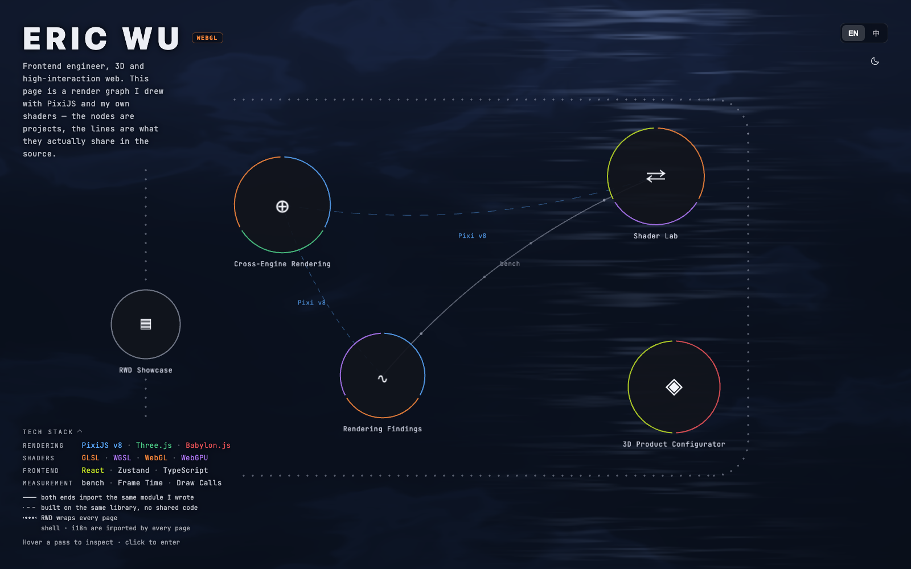
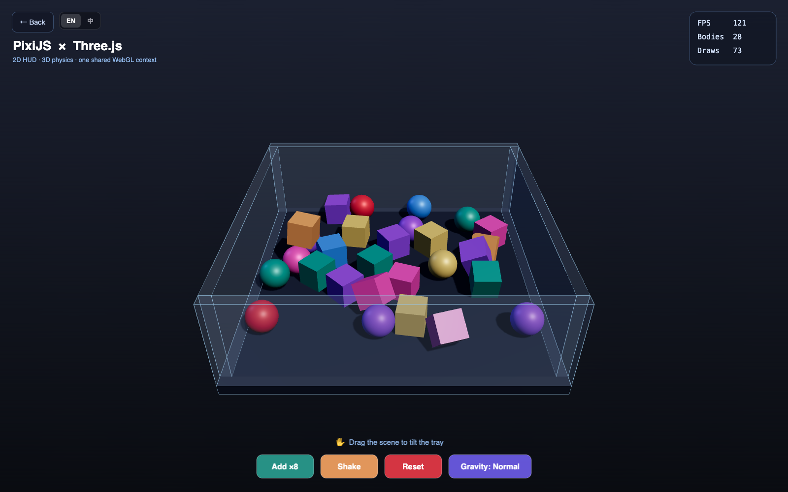
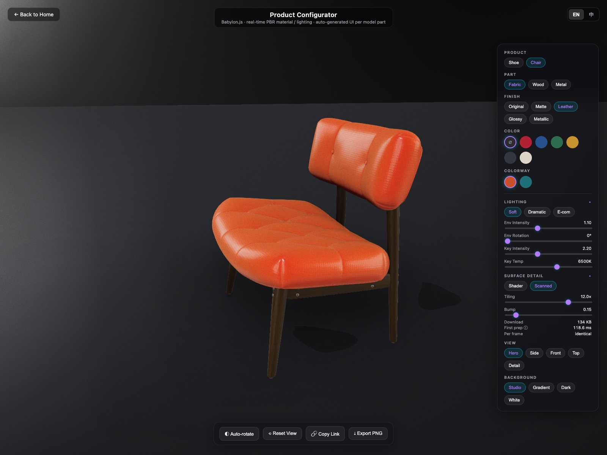
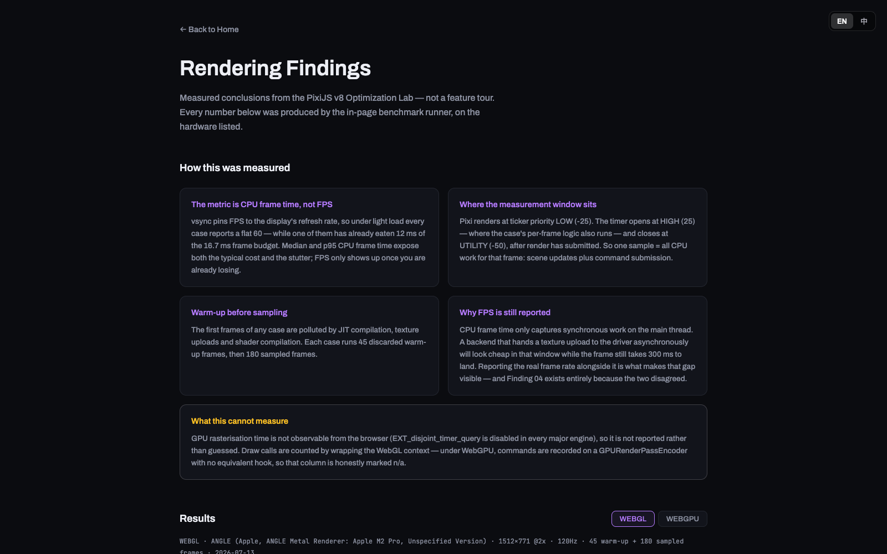
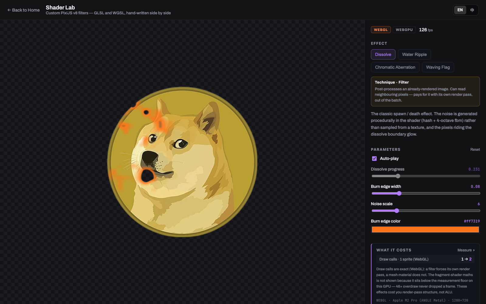
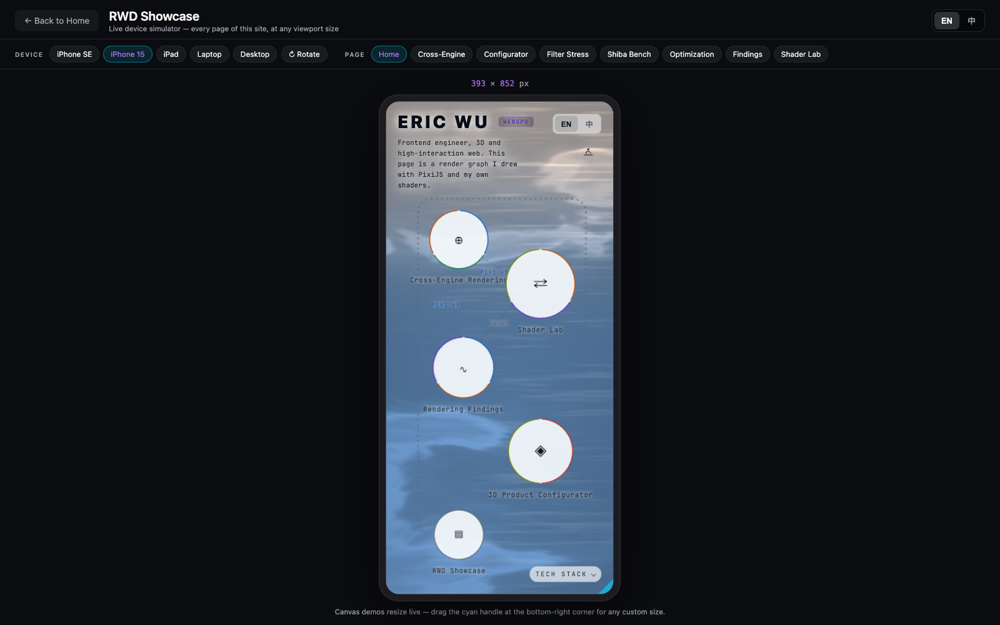

# Interactive 3D & Cross-Engine Frontend Demos

> TypeScript 打造的高互動前端技術作品集——聚焦前端比較複雜的部分：**跨引擎渲染整合**、**即時 3D / PBR 渲染**、**手寫 shader（GLSL 與 WGSL 雙寫）**，以及**可重現的渲染效能分析**。

🔗 **線上 Demo**：https://momowu910.github.io/demoMyself/



<sup>首頁本身就是作品集的入口與第一個 demo：一張用 PixiJS 與自寫 shader 畫的互動 render graph。</sup>

---

## 關於這個作品集

我有 6 年高互動前端（TypeScript + Canvas / WebGL）開發資歷。這個作品集把長年累積的**即時渲染、複雜狀態與效能**能力，延伸到 **3D 與引擎底層整合**領域，做成幾個聚焦的技術驗證。

---

## 首頁：一張「活的 render graph」與動線 — `src/home/`

首頁不是靜態選單，而是一張用 PixiJS 畫的**互動式 render graph**：每個專案是一個 pass（節點），節點之間的連線代表它們**共用的技術**（WebGL Context、Pixi v8、`src/bench`、GLSL·WGSL；兩端都用到才連線）。

- **節點外框是「這個 pass 用什麼做的」**：每段顏色對應一項引擎或著色器語言，與左下角技術棧同一套映射、互為對照。
- **架構分工**：**React 管 canvas 外的殼（標題 / inspector / 圖例），Pixi 管 canvas 內的世界（shader 光場 / 節點 / 資源流動）**，兩邊只透過一個 Zustand store 溝通，React 不參與 render loop。
- **互動**：hover 節點高亮它與相連節點、旁邊長出細節卡；點擊時「往節點顏色 zoom」轉場，落地頁再從同色淡出揭開，整站像一個連續空間。鍵盤可 Tab 聚焦、尊重 `prefers-reduced-motion`。
- **省電**：全螢幕 shader 光場以半解析度渲染、幀率上限 30fps、分頁切走即暫停，避免持續高 GPU 負載讓裝置發燙。

### 動線

```text
首頁 render graph
├─ Cross-Engine Rendering（PixiJS × Three.js）
├─ 3D Product Configurator（Babylon.js）
├─ Shader Lab（GLSL + WGSL）
├─ RWD Showcase（裝置模擬器）
└─ Rendering Findings（實驗結論）
      └─ 底下的三個壓測實驗：
         ├─ Filter Stress Test        （pixi_stress）
         ├─ Super Shiba Mark          （pixi_stress2）
         └─ Optimization Lab          （pixi_optimization）
```

---

## Demo 一覽

### 1. 跨引擎渲染整合：PixiJS × Three.js 共用 WebGL Context — `src/pixiJSDemo/pixiXthree/`



旗艦 demo，一個互動物理沙盒。讓 **PixiJS（2D HUD）** 與 **Three.js（3D 物理場景）** 繪製在**同一個 WebGL Context**，而非疊兩層 Canvas。拖曳可傾斜容器讓物件滾動，2D HUD 疊在 3D 上即時顯示 FPS / Draw Call / 物件數，並提供 Add / Shake / Reset / Gravity 控制。

**解決的硬問題**
- **共用 Context 的狀態污染**：兩個引擎共用同一 GL Context 時，Depth Test / Culling / Stencil / Scissor / Framebuffer 等狀態會互相污染導致畫面錯亂——每幀明確還原 GL 狀態，並呼叫各自的 `resetState()` 才交棒給對方繪製。
- **記憶體與效能**：單一 Canvas / Context，省去多 Canvas 疊合的記憶體與合成成本。
- **Resize 與 DPI 一致性**：兩個 renderer 共用同一解析度（retina 下統一 DPR），避免各自縮放造成畫面溢出；矮視窗（手機橫向）以 Three `setViewOffset` 將 3D 主體抬離底部按鈕列，不被 HUD 遮擋。
- **物理整合**：搭配 cannon-es，容器為 kinematic body，傾斜時以角速度推動內部剛體（球 / 方塊）做出真實翻滾。

### 2. 3D 產品配置器（Babylon.js）— `src/babylonJSDemo/src/configurator/`



以 Babylon.js 打造的即時 3D 產品配置器，聚焦 **PBR 渲染質感**、**即時可配置性**，以及**由模型結構長出來的 UI**。可切換球鞋與單椅兩顆模型，整組設定能編成網址分享、也能匯出成圖。

**model-agnostic：UI 是模型長出來的，不是寫死的**

- 部件**依材質分組**自動產生：單椅有 fabric / wood / metal 三種材質 → 面板長出三個部件；球鞋是單一 mesh 單一材質 → 「部件」整段自動隱藏。換一顆模型不用改任何一行 UI 程式。
- 早期是「一個 mesh 一個部件」，換上真正分件的模型才發現會長歪：同一張椅子的木頭可能拆成十一個 mesh 卻只有一種木頭材質，面板就長出十一顆調同一件事的按鈕。**使用者心裡的「部件」是材質，不是 mesh。**
- 部件名稱優先取自材質名（`fabric` / `wood` / `metal` 這類語意化命名），mesh 名常常只是 `Object_12`。
- **小到看不出來的部件會被濾掉**：品牌標籤、螺絲這類配件佔一顆按鈕，按下去卻看不出哪裡變了——能配置卻看不到效果的選項，比沒有更糟。判準是包圍盒體積佔比（門檻 1%），不是寫死排除名字：實測單椅四個部件是 67% / 83% / 48.5% / **0.24%**，中間隔了三個數量級。

**表面細節：同一種材質，兩種實作並陳**

finish preset 原本只調 metallic / roughness / clearCoat 三個數字，所以「皮革」與「霧面」的差別只是反光強弱、看不出材質。補上法線與粗糙度之後，刻意做成**兩個可切換的來源**，因為兩者的取捨正是這頁想講的事：

| | Shader 程序生成 | CC0 掃描貼圖 |
|---|---|---|
| 下載 | **0 KB**（GLSL 2.9 KB 在 bundle 內） | 81–203 KB／材質 |
| 首次準備 | 2.2 ms（含 GLSL 編譯時 424 ms） | 11–18 ms |
| 每幀成本 | **相同** | **相同** |
| 真實感 | 較弱 | 較好 |

- **面板顯示的是下載量與準備耗時，不是 FPS**。兩種來源都只 bake 一次（`ProceduralTexture` 的 `refreshRate = 0`），之後每幀都只是一次貼圖取樣，成本完全相同——擺一個永遠一樣的 FPS 上去等於暗示它們有效能差異。數字全是量到的：傳輸量查 Resource Timing 的 `encodedBodySize`，耗時用 `performance.now()` 夾，不寫死常數（寫死的數字會在換素材之後悄悄變成謊言）。
- 程序生成那一支 GLSL **同時服務三種紋理 × 兩種輸出**（`uKind` / `uMode`），而不是寫六支——三種紋理只差在高度函式怎麼堆 noise，高度轉法線的推導完全共用。所有 noise 都帶 period 參數先取模，否則貼圖左右邊界的隨機值對不起來，模型上會出現一條直的接縫。

**設定可分享、畫面可匯出**

- 整組設定編進**人看得懂的網址**（`?model=chair&fin.part_0=leather&bg=white&cam=top`）而不是 base64 的一坨：可以直接改網址列來試、貼進 issue 時看得出差在哪，加欄位也不會讓舊連結失效。
- 五個機位 preset（Hero / Side / Front / Top / Detail）只存角度與距離倍率，實際距離是依模型尺寸算出來的，換一顆大小完全不同的模型不必重調。**機位進得了分享連結，自由拖曳的角度不進**——機位是離散、有名字、能還原的，拖出來的角度不是。
- **匯出 PNG 刻意讀 canvas 而不是另開 RenderTarget 重畫**：bloom / vignette / grain / SSAO 都掛在 camera 的 post-process 管線上，RTT 路徑不會套用，匯出的圖會跟使用者調了半天的畫面長得不一樣。高解析靠暫時調 `hardwareScalingLevel` 真的多畫像素，不是把小圖放大。

**渲染質感**

- **即時材質配置**：質感 preset（Matte / Leather / Glossy / Metallic，覆寫 metallic / roughness / clearCoat）、顏色 tint，並保留 glTF `KHR_materials_variants` colorway 變體。切換變體後會把使用者的選擇重新疊回新材質。
- **即時打光**：3 組打光 preset（柔光棚 / 戲劇側光 / 電商白）+ 環境光強度 / 旋轉、主光強度 / 色溫四條滑桿；背景可切 studio 天空盒 / 漸層 / 深色 / 純白。
- **IBL 環境光照**：以 prefiltered `.env` 環境貼圖作為 image-based lighting，讓 PBR 材質取得正確的環境反射（studio 攝影棚質感）。
- **後製管線**：ACES tone mapping、克制的 bloom、FXAA / MSAA、vignette、film grain，選配 SSAO2。
- **柔和陰影**：方向光 blur exponential shadow map，自動將載入的模型註冊為投影者。
- **一個 ACES 的坑**：場景走 ACES tone mapping，純白背景的 `clearColor` 要給 HDR（>1）的值後製後才接近白；而且**背景與地板要一起處理**——只換 `clearColor` 的話畫面會上半純白、下半深灰，接縫就在地平線上，看起來不像去背而像破圖。

**架構：狀態收成單一來源**

面板是 **React 19 + Zustand**，Babylon 跑自己的 render loop。重點不在「換一套寫法」，而在把散落的狀態收成一份：**每個 action 同時更新狀態並把它套進場景**——引擎不是第二份狀態，是這份狀態的輸出裝置。分成兩邊寫就會回到「UI 顯示 A、場景其實是 B」的老問題。整份狀態可以序列化成網址，從網址還原時只要對同一組 action 重放一次。

**行動裝置適配**：控制面板在手機收合為 bottom sheet；相機依面板遮擋量每幀 lerp 上移（`targetScreenOffset.y`）並拉遠 radius，讓主體完整置中於未被面板蓋住的可視區。

> 渲染質感層（IBL / 陰影 / 後製）抽成可重用的 `EnvironmentManager`、`ShadowManager`、`PostProcessManager`，參數集中在 `config/scene/renderConfig.ts`；材質與部件掃描在 `materialConfigurator.ts`、表面細節在 `surfaceDetail.ts` / `surfaceShader.ts`、分享連結在 `share.ts`。

### 3. 渲染效能實測報告（PixiJS v8）— `src/findings/`、`src/bench/`



站內 [`/findings.html`](https://momowu910.github.io/demoMyself/findings.html) 是一份**可重現**的技術報告：數據由站內的 benchmark runner 直接產出，原始 JSON 原樣存在 `src/findings/results/`，沒有手動修飾過任何一個數字。

**量測方法**（`src/bench/`）
- **主指標是 CPU frame time 的中位數與 p95，不是 FPS**。vsync 會把 FPS 鎖在螢幕更新率上，輕負載時每個案例都回報 60fps——即使其中一個已經吃掉大半個 frame budget。
- **量測窗口**：Pixi 的 render 掛在 ticker 的 `LOW (-25)`，所以計時器在 `HIGH (25)` 開啟、`UTILITY (-50)` 關閉，一個樣本 = 這一幀完整的 CPU 工作（場景更新 + 指令提交）。
- **暖機**：每個案例先跑 45 幀丟棄（避開 JIT、貼圖上傳、shader 編譯），再取樣 180 幀。
- **誠實標註量不到的**：GPU 光柵化時間在瀏覽器觀測不到（`EXT_disjoint_timer_query` 已被各引擎停用），不報告而不是用猜的；WebGPU 的 draw call 錄在 `GPURenderPassEncoder` 上、無等價攔截點，該欄位標 n/a 而不是填 0。

**四條結論**
1. **每物件一個 filter，就是每物件一個 render pass**——tint 只是頂點屬性、幾乎免費（500 個 sprite → 1 個 draw call）；改掛 ColorMatrixFilter 後合批崩潰（→ 1000 個 draw call）。
2. **Draw call 不是全部的真相**——每幀重畫 Graphics 與用預生成貼圖的 Sprite，**draw call 同樣是 1**，CPU 卻差 **6.5 倍**：成本在 CPU 端的三角化（tessellation），不在合批數。只優化「看得到的數字」不等於優化瓶頸。
3. **會變動的 Text 每幀都在重傳貼圖**——逐幀變動的文字（分數 / 計時器 / 傷害數字）一律該用 BitmapText。
4. **同一筆成本，被兩個 backend 記在不同地方**（壓軸）——500 個逐幀變動的 Text，CPU frame time 在 WebGL 是 12.7ms、WebGPU 是 182.2ms，看起來 WebGPU 慘輸 14 倍；但真實幀率剛好相反（3.2 fps vs 5.5 fps）。WebGL 的 `texSubImage2D` 把上傳丟給驅動就返回，大部分成本從沒進入 CPU 量測窗口；WebGPU 同步阻塞在 JS，把整筆帳記在看得見的地方。而這台螢幕是 120Hz、budget 只有 8.3ms——兩邊其實都不及格，只是帳單開在不同地方。**只看單一指標，會讓結論完全反過來。**

> **可重現性**：上述數字經兩次獨立執行交叉驗證，誤差在 2% 以內（WebGPU 的 Text naive：177.9ms / 182.2ms）。那個反直覺的 14 倍落差是穩定現象，不是量測雜訊。

**實驗附件**（結論在前，實驗在後，供人重現）
- **Optimization Lab**（`pixiJSDemo/optimization/`）：三組 A/B 對照（Tint vs Filter、Text vs BitmapText、Sprite vs Graphics），內建 Benchmark Runner——按一次 `Run Benchmark`，就能在自己的硬體上得到自己的數字（可匯出 Markdown / JSON）。
- **Filter 壓力測試**（`pixiJSDemo/stressTest/`）：把結論 1 推到極端，直到 render pass 淹沒 GPU。
- **Super Shiba Mark**（`pixiJSDemo/stressTest2/`）：光譜另一端，10 萬+ Sprite 塞進單一批次，瓶頸從 GPU 移到 CPU-bound 變換。

### 4. Shader Lab：自訂 Filter，GLSL 與 WGSL 雙寫 — `src/shaderLab/`



站內 [`/shader_lab.html`](https://momowu910.github.io/demoMyself/shader_lab.html)。不是套現成的 filter，而是從零手寫 Pixi v8 的自訂 `Filter`——**同一個效果，GLSL 與 WGSL 各寫一份**，WebGL 與 WebGPU 兩條路徑跑出同一個畫面。v8 改版後這塊的公開資料極少，多數細節是讀原始碼與實測逼出來的。

面板上**可以直接切換實際跑的 backend**（WebGL ⇄ WebGPU），也能切換檢視兩份原始碼——所以「兩條路徑跑出同一個畫面」這句話，觀眾自己就能驗證：切過去、看同一面旗子，兩邊長得一模一樣。切換靠重載頁面（Pixi 的 renderer 類型在 `Application.init()` 就定了，中途換不了），網址因此帶著 `?renderer=`，可以直接分享「用 WebGL 跑的這頁」。**瀏覽器沒有 WebGPU 時那顆鍵會鎖起來並說明原因**——不支援時 Pixi 會靜默退回 WebGL，不講清楚的話使用者只會以為是自己點錯。

**Dissolve（程序化 noise 溶解 + 灼燒邊緣）**

- **noise 不取樣貼圖，在 shader 裡即時算**（hash + 4 個八度的 fbm）：省一張素材與一次 texture fetch，代價是每像素多幾十道 ALU 指令——在現代 GPU 上是划算的交易。
- **它的代價（不只是「做得出來」）**：真正的成本不在數學，而在 filter 本身——它會把 sprite 踢出合批、獨立成一個 render pass。一百隻正在溶解的敵人就是一百個 render pass（這正是[結論 1](#3-渲染效能實測報告pixijs-v8--srcfindingssrcbench) 量到的東西）；改成寫進 mesh 材質，它們就能重新合批。

**Water Ripple（UV 位移水波折射）**

- 和 Dissolve 的差別在本質：Dissolve 只改當前像素的顏色與 alpha，**水波則是去別的地方取樣——它是一個 gather 操作**。要讀鄰近像素就得先有一張「已經畫好」的輸入貼圖，這正是它**必須**是 filter 的原因，也是它必然要付一個 render pass 的原因。
- **padding 是直接乘在成本上的**：波峰會把畫面往外推，沒有 padding 的話超出 frame 的那一圈會被切平；但 filter 的暫存貼圖是 `(w + 2p) × (h + 2p)`——在一個 200×200 的 sprite 上，padding 從 0 加到 40px 就是 **2.0 倍的 fillrate**。padding 不是「設大一點比較安全」的參數。
- 位移量以**像素**為單位、再用 `uInputSize.zw` 換算回 UV，參數的意義才不會隨 sprite 大小漂移；取樣座標一律用 `uInputClamp` 夾住，因為 filter 的輸入貼圖是圖集的一塊，越界會吃到隔壁的內容。

**Chromatic Aberration（鏡頭色差）**

- 同一個座標取樣三次，三次的位置沿著「離開中心的方向」各自錯開，每次只取一個 channel。**偏移量隨著離中心的距離增加**（`uFalloff` 指數）——這是色差之所以是色差的關鍵，均勻的整片位移不是色差，那只是印刷沒對準。
- **花掉的是貼圖頻寬，不是 ALU**：每像素從一次 fetch 變成三次。而頻寬正是行動裝置 GPU 最先耗盡的資源——這跟 Dissolve「多幾十道算術指令很划算」是完全不同性質的帳。
- **預乘 alpha 的隱晦陷阱**：三個取樣點落在不同位置、各自帶著不同的 alpha。直接把三個預乘後的 channel 拼起來，等於每個 channel 被「別人的」alpha 加權過，半透明邊緣會浮出一圈**不是特效、是 bug** 的色邊。正解是三個樣本各自先除回自己的 alpha，組合後再用一個共用的 alpha（取三者最大，否則邊緣散出去的顏色又被裁掉）重新預乘。

**Waving Flag（Mesh + 頂點著色器）**

- 前兩個都在 fragment 階段做文章；**這一個的幾何是在 vertex shader 裡被扭曲的**。一張 48×16 細分的 plane，每個頂點依自己離旗杆的距離算出正弦波位移。旗面是程式生成的格線——**直線彎成波浪，才看得出幾何真的被改了**。
- **明暗不是打光，是波的斜率**：對位移函數取導數，一行 `cos` 就換到立體感。這裡有個坑：斜率的真實量級是 `振幅 × 頻率`，直接拿來當明暗會在大振幅下整片飽和、只剩一半亮一半暗的硬邊——明暗要的是波的**相位**，不是它的絕對陡度。
- **它是「寫進 mesh 材質」的實例**，也就是前兩張成本卡一直在講的那個替代方案：shader 就是物件的材質本身，**沒有額外的 render pass、沒有暫存貼圖、不會被踢出合批**。48×16 = 768 個頂點，對比 fragment shader 要碰的幾十萬個像素——只要動作能用幾何表達（旗幟、草叢、水面、角色呼吸），就該在 vertex 階段做。
- **代價是絕對的**：vertex shader 讀不到自己以外的任何像素——這正是水波那種 gather 效果**沒辦法**用這條路做的原因。這個取捨是整個 Lab 想講的核心，所以面板上直接標出每個效果是 `Filter` 還是 `Mesh material`。
- Pixi v8 自訂 mesh shader 的接線在網路上幾乎查不到，是讀 Pixi 原始碼挖出來的：**WebGL** 端 `GlMeshAdaptor` 會把 `groups[100]` / `groups[101]` 設成 global / local uniforms（普通 uniform，不是 UBO）；**WebGPU** 端 Pixi 靠 `layout[0].globalUniforms` 與 `layout[1].localUniforms` **這兩個名字**存不存在，來決定要不要自動綁定那兩個 bind group——名字改掉就沒人餵值，自訂資源只能從 group 2 開始擺。

**三個踩到的坑（都屬於「只丟 warning 不丟 error」那一類）**

1. **WGSL 的 `mainVertex` 參數後面一定要有尾逗號**。Pixi v8 用 regex 解析 WGSL 的 vertex attribute，型別後面必須接「逗號 / 空白 / 字串結尾」；把參數擠成單行會讓型別後面變成右括號 → attribute 解析成空物件 → pipeline 的 VertexState 缺 slot 0 → **render pipeline 靜默失效、畫面全白**。
2. **GLSL 端引用 `uInputSize` 必須標 `highp`**。Pixi 的預設 filter vertex shader 也宣告了它，而 vertex 階段的 float 預設精度是 highp、fragment 階段是 mediump——同一個 uniform 在兩階段精度不符，program 就 link 不起來（`Precisions of uniform 'uInputSize' differ between VERTEX and FRAGMENT shaders`），畫面同樣直接不出來。
3. **premultiplied alpha**：filter 的輸入輸出都是預乘的，要改顏色就得先除回去、算完再乘回來，否則半透明邊緣會出現一圈髒黑邊。

**兩個 backend 的輸出比對**

以 `renderer.extract.pixels()` 讀 framebuffer 逐像素比對（headless 下 WebGPU 的 canvas 截圖是空白的，用 screenshot 會得到錯誤結論；時間驅動的效果還要先凍結 `uTime`，否則比的是兩個不同時刻的畫面）。

| 效果 | 不同的像素 | 差異落在哪 |
|---|---|---|
| Dissolve | 3.76% | 全部在 1px 寬的輪廓線上 |
| Water Ripple | 2.78% | 全部在 1px 寬的輪廓線上 |
| Chromatic Aberration | 2.59% | 全部在 1px 寬的輪廓線上 |
| **Waving Flag** | **0.00%** | **逐位元組完全相同** |

把 diff 畫成點圖後，前三者的紅點全部落在輪廓上、內部一個都沒有——**圖案本身完全一致**，差異來自浮點捨入被陡峭的函式放大成 alpha 硬跳（Dissolve 的 `smoothstep` 過渡帶只有 0.02，貼圖的抗鋸齒邊緣同理）。旗幟則因為旗面是不透明矩形、沒有那種放大器，兩條路徑吐出**一模一樣**的畫面——這反過來證實了差異的來源就是邊界，而不是 shader 邏輯。

順帶一提，這也正是 hash-based noise **不該**用來做需要跨平台一致的畫面（replay、網路同步）的原因。

**面板上直接標出每個效果是 `Filter` 還是 `Mesh material`**——因為那是成本的分水嶺，不是實作細節。

**架構：React 管 canvas 外，引擎管 canvas 內**

控制面板是 **React 19 + Zustand**，Pixi 跑自己的 render loop，兩邊唯一的接點是一個 store——面板寫參數，舞台每幀讀。React 完全不參與 render loop（60fps 的東西不該經過 virtual DOM）。這是這類產品的真實架構，而不是把引擎硬塞進 component 生命週期。加一個新 shader = 新增一個 `EffectDef` 檔案並註冊，頁面、參數控制項、原始碼檢視都會自動長出來。

### 5. RWD Showcase：站內建裝置模擬器 — `src/rwdShowcase/`



全站（含每個 canvas demo 的 HUD）都做了 RWD——任何裝置、任意拖拉視窗都不會爆版。這一頁把它變成可互動的展示：

- **真實 viewport 預覽**：以 iframe 用實際 CSS 尺寸載入本站任一頁面，RWD 斷點反應是真的，不是縮圖。
- **裝置預設集**：iPhone SE / iPhone 15 / iPad / Laptop / Desktop，一鍵直橫向切換。
- **自由拖拉**：拖曳外框右下角手把即時拉出任意尺寸，canvas demo 會跟著即時 resize。
- **效能護欄**：全程僅一個 live iframe（一次只跑一個 WebGL demo）；外框超出舞台時以 `transform: scale` 等比縮放，模擬器本身在手機上也不爆版。

> RWD 驗證方式：Playwright 以 6 種視窗尺寸（375×667 → 1920×1080，含橫向）× 全部 10 頁跑截圖矩陣，自動檢查橫向溢出（`scrollWidth > clientWidth`）與 console error。

---

## 技術堆疊

- **語言**：TypeScript
- **渲染引擎**：Babylon.js v8、PixiJS v8、Three.js
- **Shader**：手寫 GLSL（300 es）與 WGSL，Pixi v8 自訂 `Filter`（`GlProgram` / `GpuProgram` 雙寫）
- **UI / 狀態**：React 19 + Zustand（Shader Lab 與產品配置器的控制面板；canvas 外歸 React、canvas 內歸引擎，兩邊只透過 store 溝通）
- **效能量測**：自製 benchmark runner（`src/bench/`）— CPU frame time 中位數 / p95、draw call 攔截、環境偵測，可匯出 Markdown / JSON
- **3D / 材質**：PBR、IBL（`.env` prefiltered environment）、glTF（KHR_materials_variants）、程序生成法線／粗糙度貼圖（`ProceduralTexture` + 自寫 GLSL）
- **物理**：cannon-es
- **動畫**：GSAP
- **i18n**：自製輕量中英雙語切換（`src/i18n`，localStorage 持久化）
- **建置 / 部署**：Webpack、gh-pages

---

## 素材與授權

程式碼以外的素材全部來自可自由使用的來源，出處列在這裡：

| 素材 | 來源 | 授權 |
|---|---|---|
| `shoe.glb` | [MaterialsVariantsShoe](https://github.com/KhronosGroup/glTF-Sample-Assets/tree/main/Models/MaterialsVariantsShoe) © 2021 Shopify | CC BY 4.0 |
| `SheenChair.glb` | [SheenChair](https://github.com/KhronosGroup/glTF-Sample-Assets/tree/main/Models/SheenChair) © 2020 Wayfair, LLC | CC0 1.0 |
| 表面細節貼圖（fabric / leather / metal） | [ambientCG](https://ambientcg.com) — Fabric019 / Leather011 / Metal009 | CC0 1.0 |
| 字型 | Archivo、JetBrains Mono（self-host） | SIL Open Font License 1.1 |

貼圖取原始 1K 包裡的 `_NormalGL`（OpenGL 慣例，**不是** `_NormalDX`）與 `_Roughness`，縮到 512px、JPEG 品質 78，六張合計約 430 KB——尺寸是刻意壓的，配置器已經帶著一顆 7.5 MB 的模型。細節見 `src/babylonJSDemo/res/*/CREDITS.md`。

---

## 本機執行

```bash
yarn install   # 或 npm install
yarn start     # 啟動後開啟 http://localhost:8080
```

---

## 作者

**Eric Wu** — Frontend Engineer（高互動 / 3D / 複雜 Web 應用）
momowu.works@gmail.com
